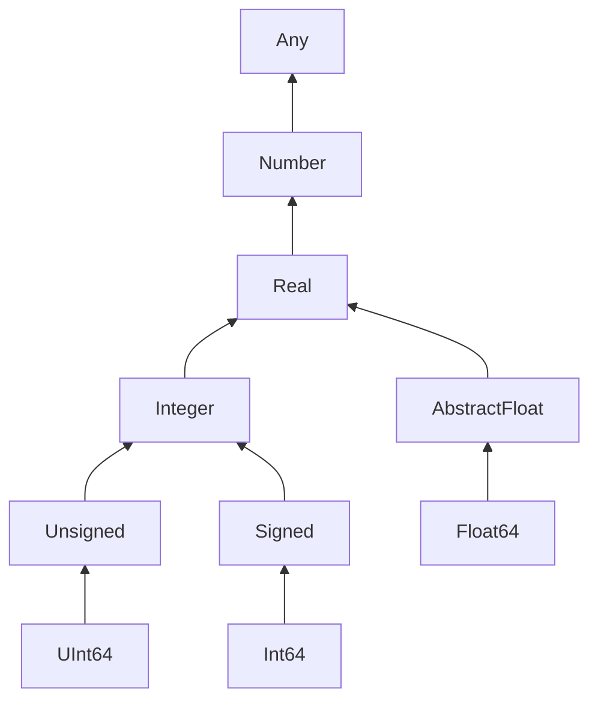
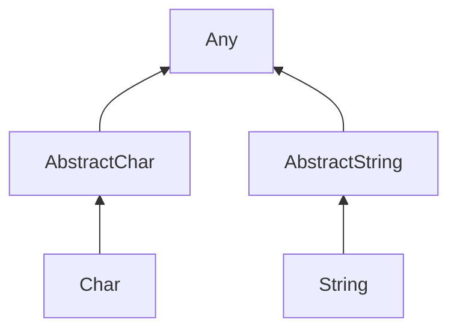
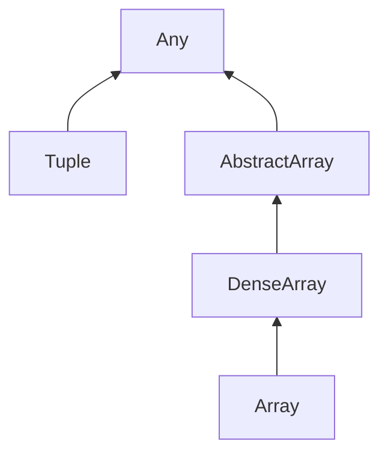
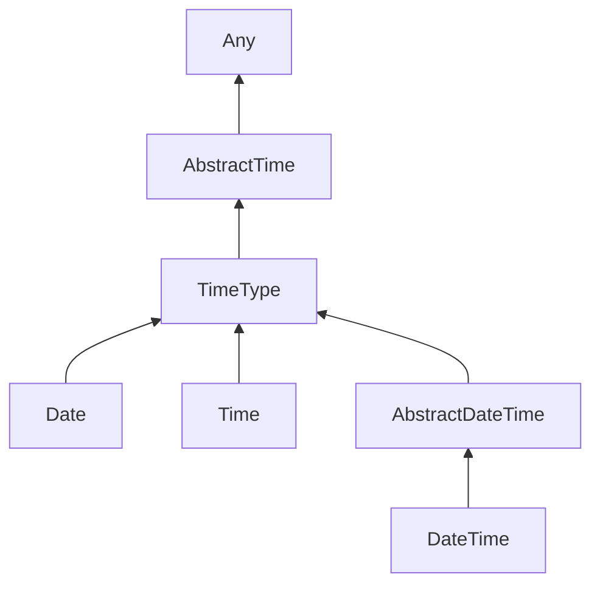

## Bool

Any -> Number -> Real -> Integer -> Bool

## Integer and Float Types

## Char and String Types

## Tuple and Array Types

### Tuple

- Stores a fixed number of items (not intended for large amount of items)
- Can store different types of values
- The parenthesis `()` are optional
- Immutable
- Order sensitive
- Starts from index **1**, not zero.

### Array

- Store any amount of values
- Must be homogeneous
- Multidimension supported (vector, matrix)
- Mutable
- Order sensitive

## Date, Time and DateTime Types

